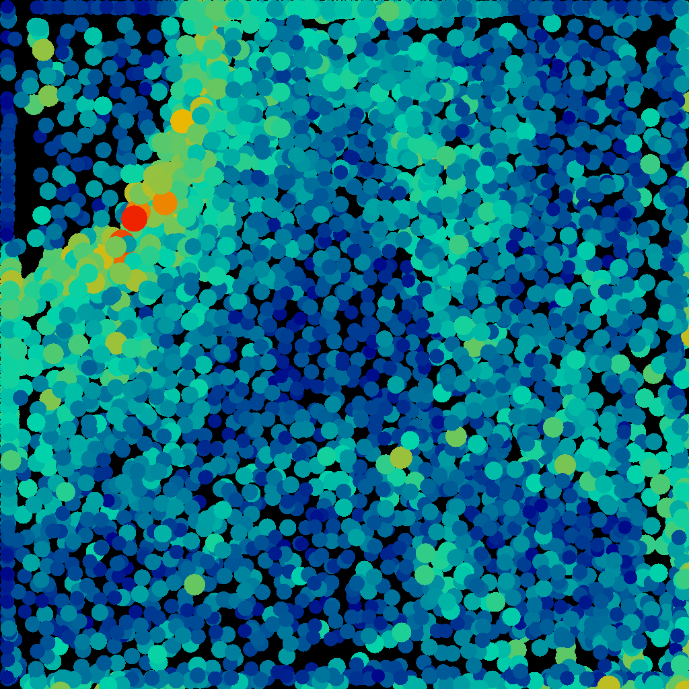
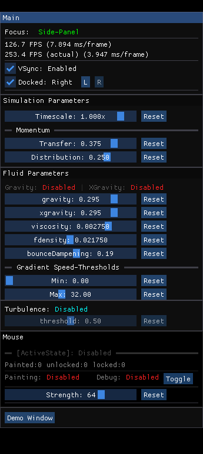
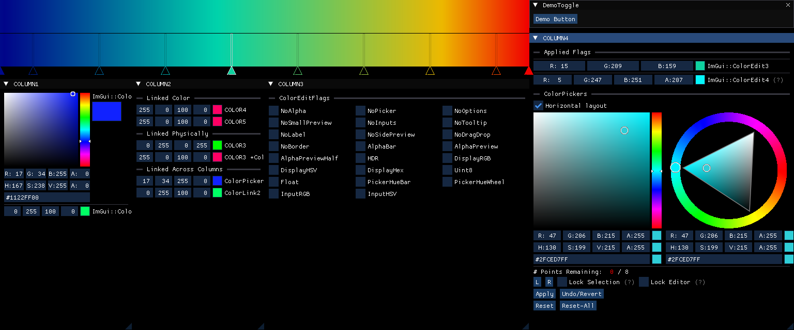
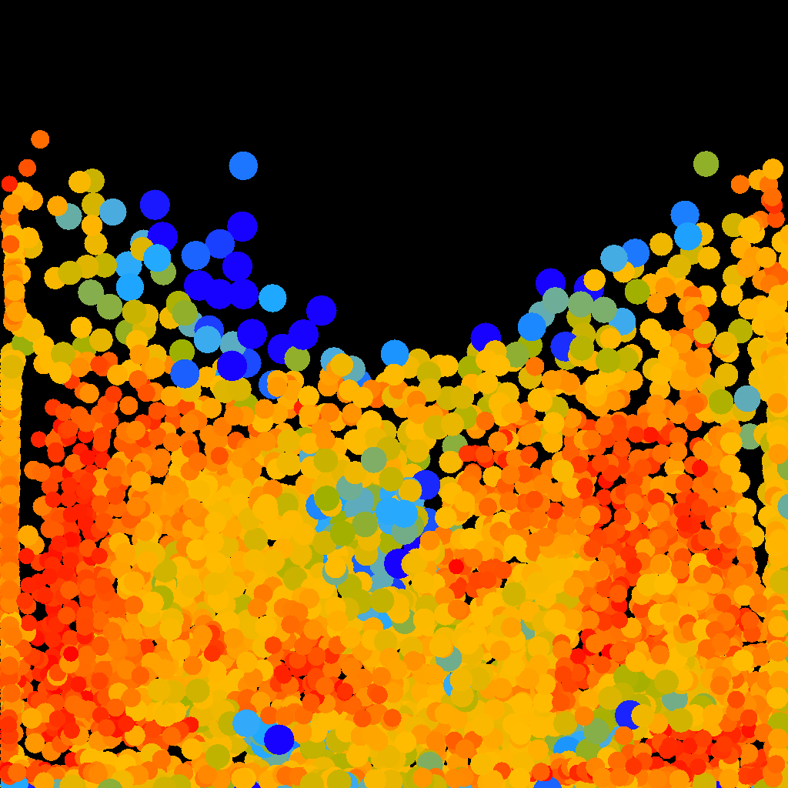
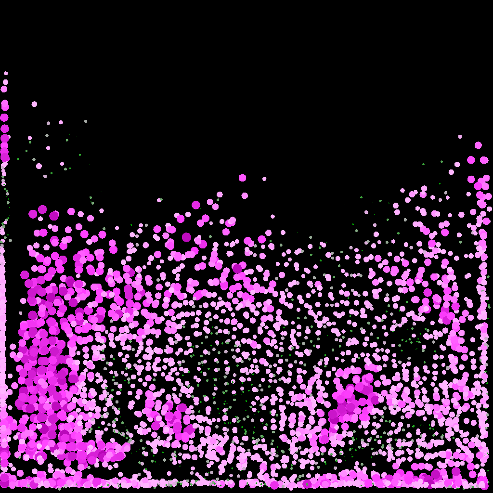
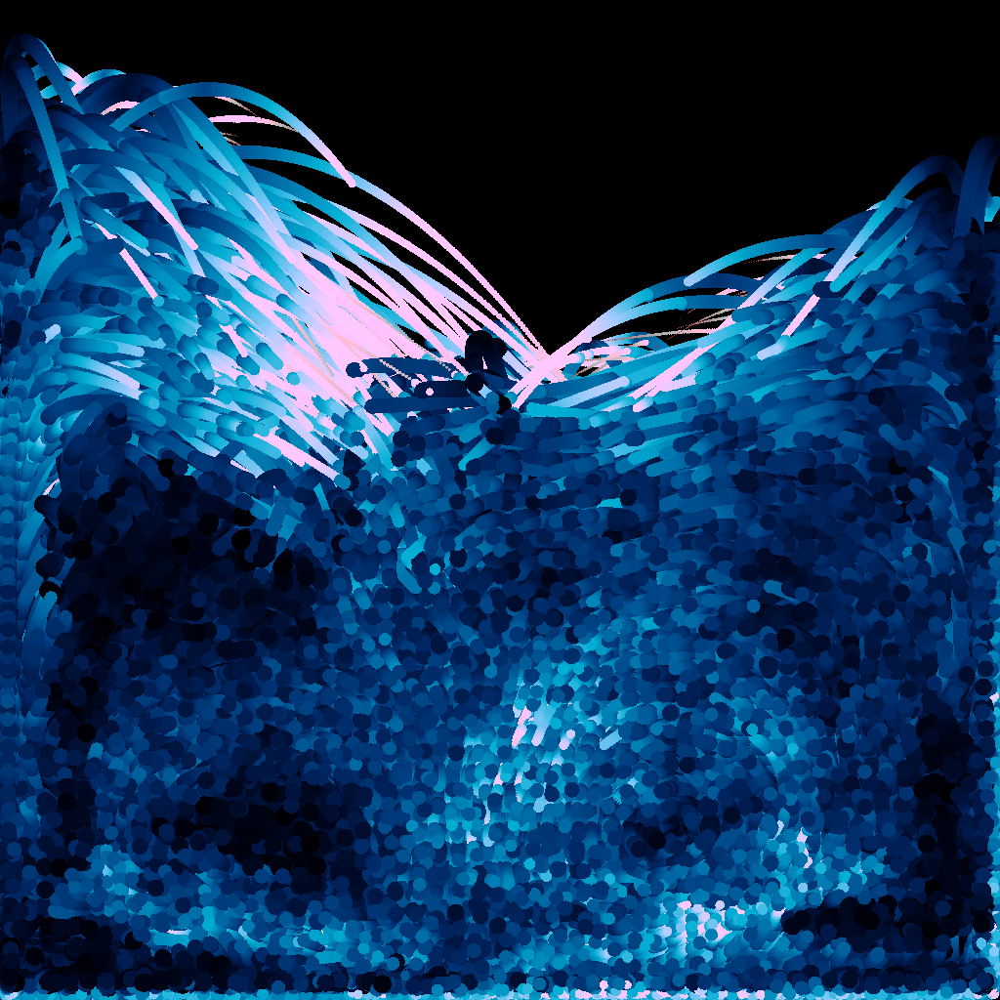

A Fluid Simulation
------------------

### a recreational / artistic program

-----------------------------------

## screenshots
|                                                |                                          |
|------------------------------------------------|------------------------------------------|
|  |  |

### shaders

| red                                            | cherry blossoms                                        | turbulence                                     |
|------------------------------------------------|--------------------------------------------------------|------------------------------------------------|
|  |  |  |

----------------
## Keybinds
<blockquote>

F1:  print all keybinds

Q:   Exits the program

F2:  open the gradient window \
close it with Q or F2 again

Tilde:   open the side-pane \
(while open) switches focus between side-panel and main-window
- Left/Right: switch docking side of side-panel
- Q/ESC: close side-panel

------------------------------------

Space:   pause/unpause simulation

BackSpace:   freeze particles \
all velocities are zeroed. (it also pauses the simulation)

R:   Reset the simulation

G:   toggle gravity \
(+Shift):  xgravity

Tab: toggle mouse interactions \
(while the mouse is enabled, it will be displayed as a circle)

Mouse-interactions: (hold) \
    Left-Click  = Push (increases density) \
    Right-Click = Pull (negative density) \
    ScrollWheel resizes effect radius \
    Side-buttons clear any painted areas (in painting mode)

P:   toggle painting-mode \
in painting-mode, mouse-interactions stay active over traveled areas \
    (until mouse-button is released)
- While actively painting, clicking the opposite mouse-button will lock the painted cells.
- Use the mouse's side-buttons to clear any locked cells. (Or hit 'K')

K:   clear painted cells (painting mode)

C:   toggle cell-grid display

T:   toggle turbulence-mode \
modifies physics calculations to encourage perpetual motion

M:   toggle between Old / New update methods \
Old method is better overall (especially for turbulence-mode) \
New method is faster but not technically correct (physics don't timescale)

Y:   toggle particle transparency

U:   toggle particle-scaling direction (positive/negative)

</blockquote>

Number-keys switch active shader. \
press zero to reset (no shader active)

----------------
### important variables
you should assign a suitable value for 'THREAD_COUNT' in 'Threading.hpp' (default 8) \
window-size is hardcoded in 'Globals.hpp': 'BOXWIDTH' / 'BOXHEIGHT' \
other globals you may want to customize: \
NUMCOLUMNS / NUMROWS \
SPATIAL_RESOLUTION \
DIFFUSION_RADIUS

